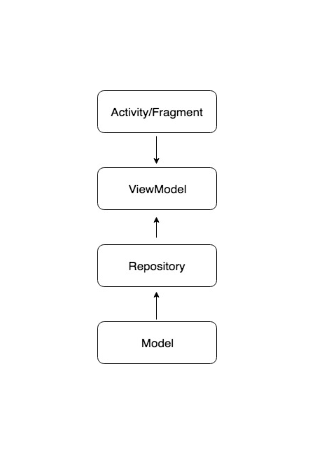
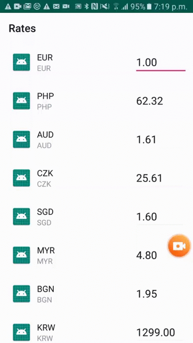

# Currency Exchange Rates

MVVM Design Structure by using RXJava2 with LiveData and Repository Patterns.

The application fetchs the currency rates APIs per each second to get following response:
```
{
    base: "EUR",
    date: "2018-09-06",
    rates: {
        AUD: 1.6098,
        BGN: 1.9478,
        BRL: 4.7723,
        CAD: 1.5276,
        CHF: 1.1229,
        CNY: 7.9128,
        CZK: 25.61,
        DKK: 7.4264,
        GBP: 0.89459,
        HKD: 9.0953,
        HRK: 7.4039,
        HUF: 325.16,
        IDR: 17253,
        ILS: 4.1536,
        ...
    }
}
```

# Project Architechure
By using MVVM design pattern with Google Android Architecture Components (AAC). And RXJava2 to perform data binding with Android Architecture Lifecycle, it observes and monitor the network data fetched from Fuel Library.

The following diagram shows the flow how it works in the project:




# Preview


# TDD Test Case
In this example, we added several Test Driven Development (TDD) test cases for some simple checking of UI and view model. 


# Library Used:
Dagger2 (Dependency Injection)
Fuel (Network Library)
RxJava2 (Data binding)
Mockito-Kotlin (Unit Test)
